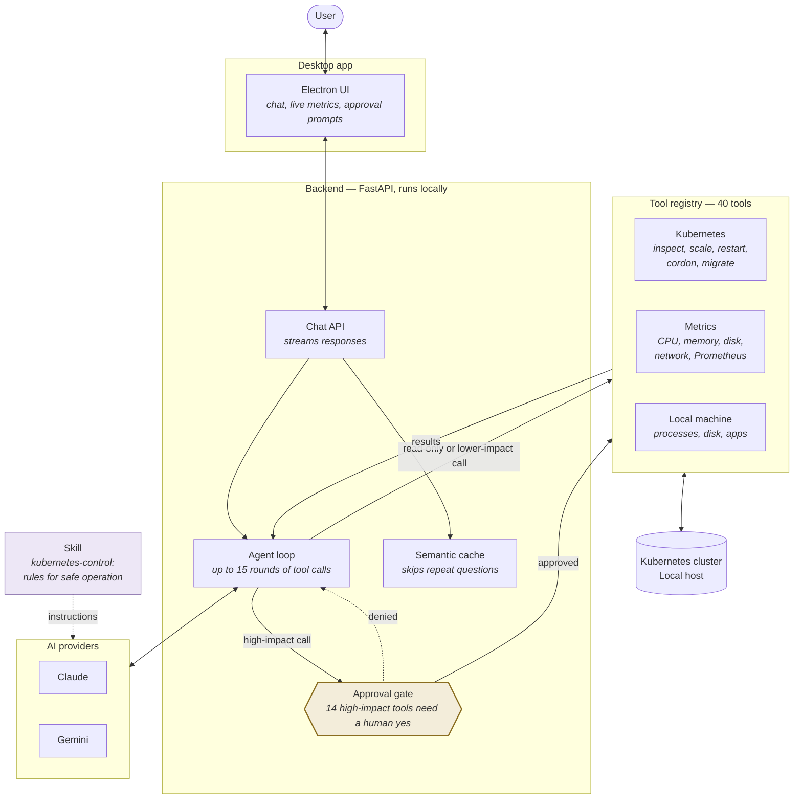

# EdgePilot — Architecture

## What it is

An AI copilot for cluster operations whose application and tool-execution
layers run on premises. Users submit requests in plain English. EdgePilot reads
system state through local tools, then either answers or proposes an action.
Fourteen high-impact operations stop at a human-approval gate before execution.

The application, tool execution, and data stores run locally. When Claude or
Gemini is selected, the prompt and tool results needed for the conversation are
sent to that provider's API. Credentials and kubeconfig contents must not be
included.

## The system

## The pieces

| Piece | What it does |
|---|---|
| **Electron UI** | Desktop chat window, live telemetry, approval prompts |
| **FastAPI backend** | Runs locally. Manages chats, calls the model, executes tools |
| **Agent loop** | Model calls a tool → backend runs it → result goes back to the model → repeat until done |
| **Approval gate** | 14 high-impact tools stop and wait for human approval. The registry classifies 15 tools as state-changing; `ingest_historical_sample` is explicitly exempt |
| **Skill** | A written set of rules the model follows: verify capacity, explain the change, never guess a name |
| **Tool registry** | 40 tools. 25 read-only, 15 change something |
| **Semantic cache** | Recognises a repeat question and answers without calling the model |
| **Providers** | Claude and Gemini are swappable. GPT is a placeholder |

## Where the data comes from

- **Kubernetes** — cluster state obtained through the local Kubernetes API
  client. Capacity results represent request-based scheduling headroom, not
  real-time free CPU or memory.
- **Prometheus / Grafana** — real-time hardware utilization metrics such as
  CPU and memory usage.
- **Local host** — CPU, memory, disk, processes
